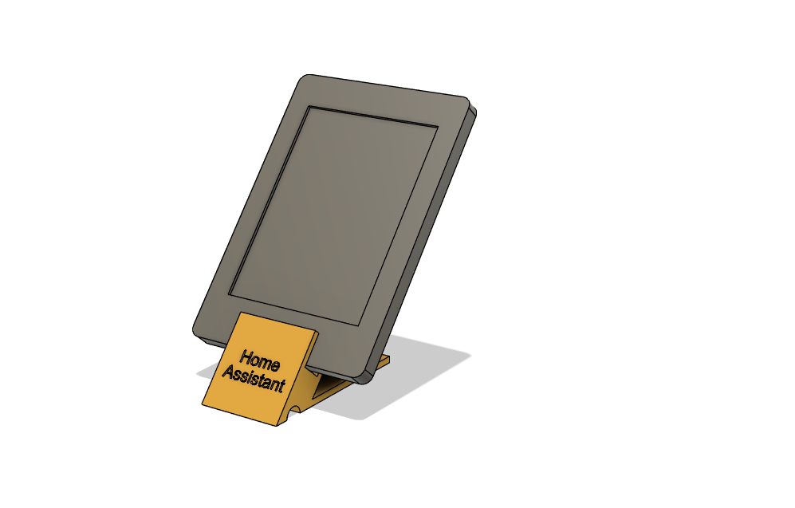
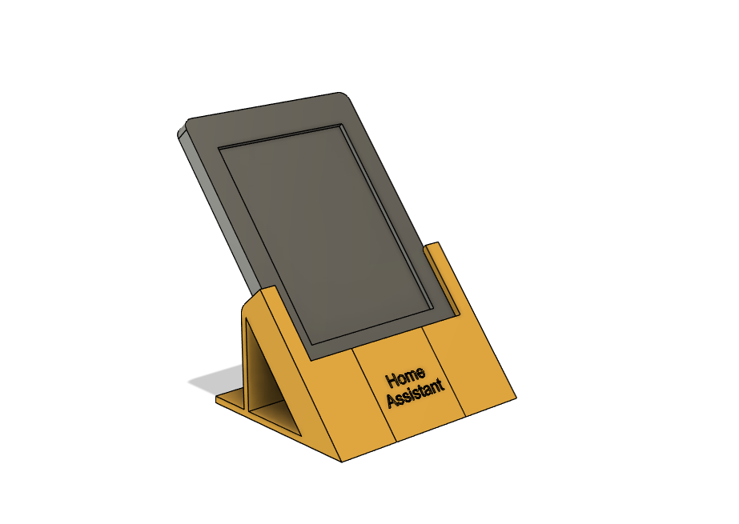

# HomeAssistant Kindle PaperWhite 1/2 Dashboard

## Dashboard

Uses [AppDaemon](https://appdaemon.readthedocs.io/en/latest/) and a custom Dashboard along with [Alpine Linux + Midori Browser](https://github.com/thomaspreece/alpine_kindle). If using the Docker version of AppDaemon then you'll want to put this repo in `MY_CUSTOM_FOLDER` assuming you are using the `-v MY_CUSTOM_FOLDER:/conf` option.

See https://thomaspreece.com/blog/?p=359 for more details of design choices.

## Kindle Magnetic Charging Mount

You can find the designs and images of a magnetic charging doc I designed for the Kindle in the kindle_holder folder.

